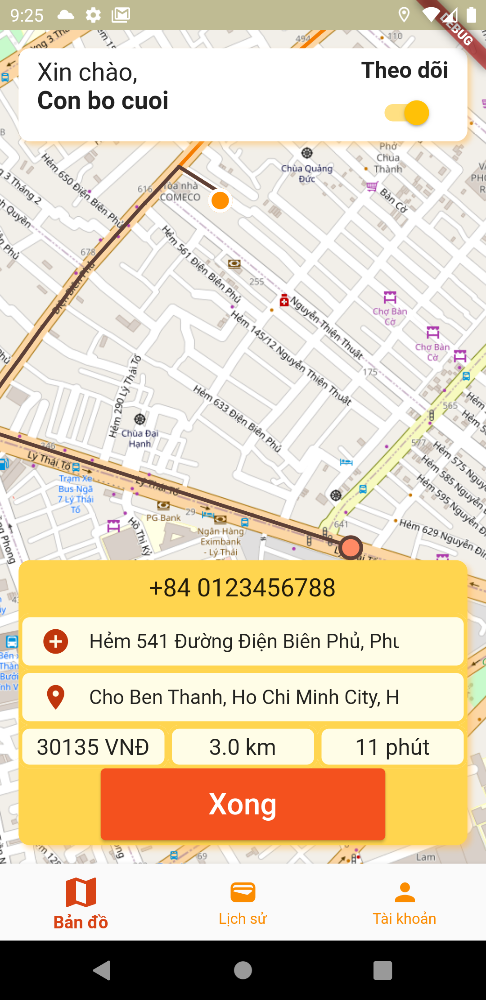
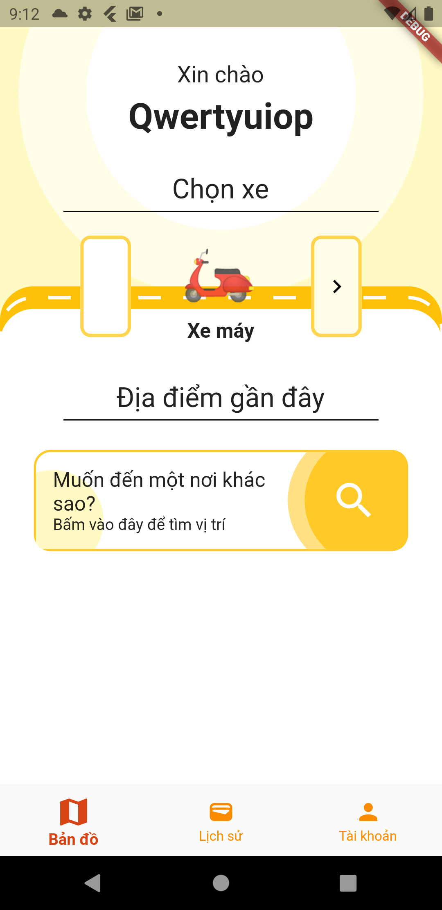
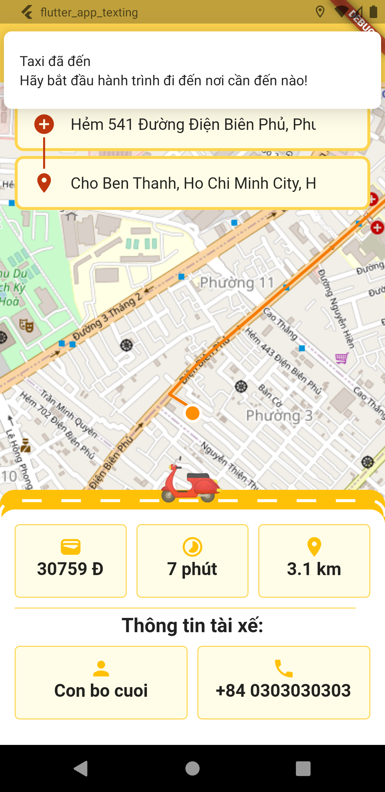

# Ứng dụng di động taxi
___
## Lưu ý
- Xem ở branch `customer` và `driver`

## Thông tin
- **Tính chất**: Front-end
- **Ngôn ngữ lập trình**: Dart
- **Framework**: Flutter
- **Kiến trúc**: MVVM (Model - View - Viewmodel)

## Các chức năng
- [x] Tài khoản
  - [x] Đăng ký
  - [x] Đăng nhập
  - [x] Đăng xuất
  - [ ] Đổi thông tin
  - [ ] Đổi mật khẩu / quên mật khẩu
  - [ ] Xác thực

- [x] Màn hình
  - [x] Giao diện tài khoản 
  - [x] Màn hình chính
  - [x] Lịch sử

- [x] Bản đồ:
  - [x] Hiện vị trí hiện tại
  - [x] Hiện vị trí cần đến
  - [x] Hiện vị trí tài xế
  - [x] Vạch đường đi (tracking)
  - [x] Tạm lưu thông tin
  - [x] Thông báo khi tài xế và khách hàng gặp nhau
  - [x] Đánh giá tài xế thông qua số sao
  - [ ] Xử lý trường hợp tắt định vị
  - [ ] Xử lý trường hợp đăng xuất trong lúc đang thực thi
  - [ ] Xử lý khách hàng VIP (đặt hẹn giờ)
  - [ ] Áp dụng machine learning

 - [x] API:
   - [x] Tài khoản
   - [x] Bản đồ (OpenStreetMap, flutter_map, OpenRouteService)
   - [x] Thời tiết (OpenWeatherMap)

 - [ ] Thông báo:
   - [x] Flutter Local Notifications
   - [ ] Firebase Cloud Message

 - [ ] Hệ điều hành:
   - [x] Android
   - [ ] IOS

 - [ ] Yêu cầu phi chức năng:
   - [x] ? Dễ sử dụng
   - [x] Lỡ thoát ứng dụng
   - [ ] Chờ thực thi, hiện màn hình "loading"
   - [ ] Chạy tối ưu (Efficiency)
   - [x] Bảo mật

## Các thư viện sử dụng
[x] provider
[x] dotted_border
[x] http
[ ] socket.io
[x] shared_preferences
[x] location
[x] intl
[ ] google_maps
[x] flutter_map
[x] latlong2
[x] url_launcher
[x] flutter_local_notifications
[x] rxdart
[x] timezone

## Một vài ảnh demo

